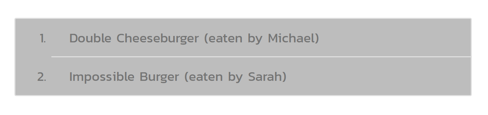

# Eat Da Burger (the Sequel)

Welcome to [Eat Da Burger](https://fast-inlet-22337.herokuapp.com/), an app for all-you-can-eat burgers.

This app keeps track of what burgers have been ordered and what burgers have been eaten. Additionally users can order more burgers to eat.

## Instructions

The Eat Da Burger process is broken up into two steps:

1. Order a burger
2. Eat a burger

### Order a Burger

1. Type in a burger to eat.
2. Click **Submit**.
3. The burger will show up on the list with the option to **Devour It**.

### Eat a Burger

1. Choose a burger to eat.
2. Type in the name of the person eating the burger.
3. Click the **Devour It** button to the right of the burger name.
4. The burger will show up in the greyed out list of eaten burgers. 

### Add an Eater

1. Go to [the Eaters page](https://fast-inlet-22337.herokuapp.com/eaters).
2. Enter the name of the Eater.
3. Click **Submit** to add the person to the list of Eaters.